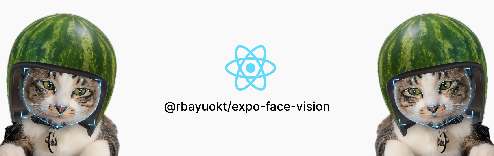
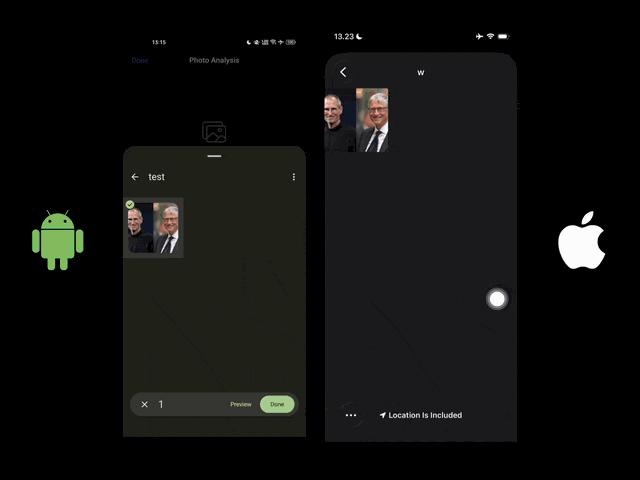

<p align="center">
  
</p>

# expo-face-vision

<p align="center">
  
</p>

<p align="center">
  <sub>That's my younger brother in the demo. Thanks for being a patient model 😄</sub>
  <br />
  <sub>The GIF has no sound. To hear the spoken KYC prompts, watch the <a href="https://drive.google.com/file/d/1itAPaHDOsTm53RGf-bKMJ0T9tsWeXvKb/view?usp=sharing">full video with audio</a>.</sub>
</p>

Face detection for React Native and Expo that runs on the device. It also comes with
ready-made flows for auto selfie capture, Face ID style scanning, KYC liveness checks, head
gestures and blink detection.

All the camera and detection work happens in native code. Android uses CameraX and ML Kit,
iOS uses AVFoundation and Vision. JS never sees the camera frames, only a small object per
frame with the faces in it, and the overlays animate on the UI thread. On an iPhone 11 Pro
it analyzes 30 frames a second at around 27 ms per frame. Nothing gets uploaded.

It doesn't do face recognition, so it can't tell you whether two photos show the same
person. For that you'd pair it with a matcher on your server.

Instead of stitching together a camera library, an ML plugin, coordinate math and your
own capture logic, you install one package and get the whole flow, from the camera to the
finished photo or the passed check.

```bash
npx expo install @rbayuokt/expo-face-vision
npx expo prebuild
```

```json
{
  "expo": {
    "plugins": [["@rbayuokt/expo-face-vision", { "cameraPermission": "Used to take your photo." }]]
  }
}
```

The config plugin sets `NSCameraUsageDescription` on iOS and makes sure `CAMERA` is
declared on Android. It needs a development build, because Expo Go doesn't ship the native
module.

In a bare React Native app, add Expo modules first, then install the package and pods:

```bash
npx install-expo-modules@latest
npm install @rbayuokt/expo-face-vision
npx pod-install
```

Without the config plugin, add `NSCameraUsageDescription` to `Info.plist` yourself. The
Android `CAMERA` permission comes with the library's manifest.

Everything beyond the core is an optional peer. Install what you use:

```bash
npx expo install @shopify/react-native-skia react-native-reanimated  # overlays
npx expo install expo-speech    # spoken prompts
npx expo install expo-haptics   # haptic feedback
```

Without `expo-speech` or `expo-haptics` the related features go quiet: nothing to
configure, and a one-time warning only if you explicitly asked for them.

## A complete example

A selfie screen that coaches the user and takes the picture by itself once their face is
in the oval, looking straight, eyes open and still for 600 ms:

```tsx
import {
  FaceCamera,
  useCameraPermissions,
  useFaceCamera,
  useFaceValidation,
  type FaceRequirements,
  type GuidanceStatus,
} from '@rbayuokt/expo-face-vision';
import { FaceGuide } from '@rbayuokt/expo-face-vision/overlays';
import { useState } from 'react';
import { Button, Image, StyleSheet, Text } from 'react-native';

// What counts as a good selfie on this screen.
const REQUIREMENTS: FaceRequirements = {
  singleFace: true,
  guide: { width: 0.7, height: 0.45 }, // the oval drawn below
  minFaceSize: 0.3,
  lookingForward: true,
  eyesOpen: true,
  stableFor: 600,
};

// The library gives you status codes; the words are yours, so translating is easy.
const HINTS: Partial<Record<GuidanceStatus, string>> = {
  NO_FACE: 'Put your face in the oval',
  MOVE_CLOSER: 'Move a bit closer',
  MOVE_FARTHER: 'Move back a little',
  LOOK_FORWARD: 'Look straight at the camera',
  OPEN_EYES: 'Keep your eyes open',
  HOLD_STILL: 'Hold still…',
  READY: 'Perfect!',
};

export default function SelfieScreen() {
  const [permission, requestPermission] = useCameraPermissions();
  const camera = useFaceCamera();
  const { status } = useFaceValidation(REQUIREMENTS, { camera });
  const [photo, setPhoto] = useState<string | null>(null);

  if (!permission?.granted) return <Button title="Allow camera" onPress={requestPermission} />;
  if (photo) return <Image source={{ uri: photo }} style={styles.fill} />;

  return (
    <FaceCamera
      camera={camera}
      style={styles.fill}
      autoCapture
      requirements={REQUIREMENTS}
      stableFor={600}
      onCapture={({ photo }) => setPhoto(photo.uri)}>
      <FaceGuide shape={REQUIREMENTS.guide} status={status} />
      <Text style={styles.hint}>{(status && HINTS[status]) ?? 'Almost there'}</Text>
    </FaceCamera>
  );
}

const styles = StyleSheet.create({
  fill: { flex: 1 },
  hint: { position: 'absolute', bottom: 80, alignSelf: 'center', color: 'white', fontSize: 22 },
});
```

Things you didn't have to write there:
- mapping face coordinates onto a mirrored, cropped preview
- deciding when "centered" and "still" are true
- keeping the hint from flickering on a threshold
- making sure the photo is taken exactly once

The user also gets a haptic tap on capture if `expo-haptics` is installed. The photo is an
upright, un-mirrored JPEG in the cache directory.

A KYC-style liveness check is about as short:

```tsx
const liveness = useLivenessChallenge({
  camera,
  steps: ['turn-left', 'turn-right', 'look-up', 'blink'], // shuffled every session
  voice: true, // reads each prompt aloud through expo-speech
  onPass: () => submit(),
  onFail: (reason) => showError(reason), // 'TIMEOUT' | 'FACE_LOST' | 'MULTIPLE_FACES' | 'FACE_CHANGED'
});
// liveness.start(), then render liveness.text and a <FaceCamera camera={camera} />
```

## What you can build with it

- **KYC and onboarding.** A liveness step with randomized head moves and spoken prompts,
  followed by a selfie taken while the face is centered and still.
- **Profile and ID photos.** Capture only photos you can use: one face, centered, eyes
  open, facing forward, well lit and sharp. Every failed rule comes back as a code you can
  show, log or translate.
- **Face ID style enrollment.** The ring of ticks that fills as the user moves their head
  in a circle, drawn by `<FaceScanRing>`.
- **Hands-free controls.** Nod for yes, shake for no, or turn the head to move between
  items, useful for accessibility or when the user's hands are busy.
- **Presence checks.** Whether a face is in frame, whether there's more than one, and
  whether the person is looking at the screen, e.g. during a remote exam or a video call
  prompt.
- **Photo tooling.** Detect every face in a gallery photo, crop and level each one into an
  avatar, and score sharpness and lighting to reject bad uploads.
- **Camera effects and prototypes.** Landmarks and contours in preview coordinates for
  stickers or masks, or blink timing for an eye-closure prototype.

## Try the example app

If something here isn't clear, the example app is the quickest way to see it working. Each
demo is one file in [`example/screens/`](example/screens), so you can read a single screen
top to bottom and copy what you need:

| Demo | File | Shows |
| --- | --- | --- |
| Identity check (KYC) | [`KycScreen.tsx`](example/screens/KycScreen.tsx) | `useLivenessChallenge`, voice prompts, selfie on success |
| Selfie capture | [`SelfieScreen.tsx`](example/screens/SelfieScreen.tsx) | `useFaceValidation`, `useFaceAutoCapture`, guidance text |
| Face scan | [`FaceScanScreen.tsx`](example/screens/FaceScanScreen.tsx) | `useHeadCoverage`, `<FaceScanRing>` |
| Head gestures | [`GesturesScreen.tsx`](example/screens/GesturesScreen.tsx) | `useHeadGesture`, `useBlinkDetection` |
| Live inspector | [`InspectorScreen.tsx`](example/screens/InspectorScreen.tsx) | `<FaceOverlay>`, `<HeadPoseIndicator>`, raw frames with `useFaceFrames` |
| Photo analysis | [`PhotoScreen.tsx`](example/screens/PhotoScreen.tsx) | `detectFaces`, `cropFace`, `alignFace`, `analyzeFaceQuality` |
| Benchmark | [`BenchmarkScreen.tsx`](example/screens/BenchmarkScreen.tsx) | The numbers in [Benchmarks](#benchmarks), on your own phone |

Everything under `example/components/` is plain React Native UI with no library imports,
so the library calls are easy to spot in each screen.

### Running the example

The camera demos need a real camera, so a physical phone works best. Photo analysis and
the JS part of the benchmark also run in a simulator or emulator.

**What you need**

- Node.js and npm.
- Android: Android Studio with the Android SDK, and a phone with USB debugging turned on
  (Settings → About phone → tap Build number 7 times, then Developer options → USB debugging).
- iOS: a Mac with Xcode and CocoaPods, and an iPhone with Developer Mode turned on
  (Settings → Privacy & Security → Developer Mode). Set your own Apple team in
  `example/app.json` under `expo.ios.appleTeamId`, since installing on an iPhone needs a
  signing team.

**First run**

```bash
git clone https://github.com/rbayuokt/expo-face-vision.git
cd expo-face-vision
npm install              # library dependencies

cd example
npm install              # example app dependencies
npm run android:debug    # or: npm run ios:debug
```

Pick your phone when it asks for a device. The first build generates the native
`example/android` and `example/ios` projects and takes a few minutes. On iOS, the first
launch may need **Settings → General → VPN & Device Management → Trust** for your
developer account.

**Day to day**

- JS changes, in the library's `src/` or the example: run `npx expo start` in `example/`,
  then press `r` to reload. After editing `src/`, run `npm run prepare` at the repo root
  first (or restart with `npx expo start --clear`) so the example picks up the new build.
- Native changes (Kotlin, Swift, or a new native package): run `npm run android:debug` or
  `npm run ios:debug` again.

**Scripts in `example/`**

| Command | Does |
| --- | --- |
| `npm run android:debug` / `npm run ios:debug` | Builds the library, installs a development build on the device you pick, starts Metro |
| `npm run android:release` / `npm run ios:release` | Release build with the JS bundled in, no Metro needed. Use it for benchmarks |
| `npm run start` | Starts Metro for an already installed development build |
| `npm run prebuild:clean` | Regenerates `example/android` and `example/ios`, e.g. after changing `app.json` |

From the repo root, `npm run example:android` and `npm run example:ios` do the example's
`npm install` and a development build in one step.

## Why use it

**One package for the whole flow.** A face feature usually means a camera library, a
frame processor, an ML plugin, coordinate math and a hand-written state machine for "when
do we take the photo". Here the camera, detection, tracking, guidance, auto capture,
liveness and overlays come from one place and are built to work together.

**Frames never cross into JS.** The camera and the detector run natively. JS receives each
analyzed frame as a small object: face boxes, angles, and optionally landmarks. Detection
runs at 10 to 30 fps, and nothing in the pipeline tries to push every display frame
through JS.

**Smooth overlays at a low detection rate.** Overlays read the latest detection from
Reanimated shared values and ease toward it on the UI thread, so boxes and rings move at
display refresh rate even when detection runs at 10 fps. Hooks only re-render React when
something they report actually changes.

**The coordinate math is done.** Face geometry is always in upright, un-mirrored image
pixels, and every face also carries `previewBounds` already mapped through front-camera
mirroring and cover/contain cropping. Left and right, and up and down, mean the same
thing on both cameras and both platforms (see [Conventions](#conventions)).

**Honest about the platforms.** ML Kit and Vision don't offer the same signals.
`getCapabilities()` says what the current device provides, a rule that needs a missing
signal fails with `SIGNAL_UNAVAILABLE`, and values like confidence are never made up.

**Codes, not sentences.** Guidance, validation issues and liveness prompts are status codes
with optional English defaults, so localizing an app doesn't mean patching the library.

**Testable without a phone.** Everything that makes decisions lives in a pure TypeScript
core with no React or native imports: tracking, smoothing, gestures, blinks, stability,
validation, guidance, auto capture and liveness. Its 92 Jest tests run in about a second.

## Benchmarks

Every number here comes from the Benchmark screen in the example app (Home → Developer →
Benchmark), so you can run the same measurements on your own phones. It also prints the
results as a Markdown table to the console. Each number is a median taken after a warm-up,
and a range covers separate runs.

| | iPhone | Android |
| --- | --- | --- |
| Device | iPhone 11 Pro (A13) | OPPO CPH2217 (MediaTek MT6779) |
| OS | iOS 26.2 | Android 13 |
| Detector | Apple Vision | Google ML Kit |
| Build | release | release |

Both phones ran release builds. If you benchmark a debug build, expect the JS rows to be
slower (up to 2.8 times on the OPPO). Detection is timed in native code and doesn't change.

**Live front camera**, with a face in 94 to 100% of analyzed frames:

| Mode | iPhone: detection | iPhone: analyzed | Android: detection | Android: analyzed |
| --- | --- | --- | --- | --- |
| `fast` (640×480) | 27 ms | 24 fps | 36 to 48 ms | 10 to 11 fps |
| `balanced` (1280×720) | 27 ms | 30 fps | 39 to 52 ms | 10 to 11 fps |
| `accurate` (1920×1080) | 29 ms | 30 fps | 63 to 64 ms | 10 to 12 fps |

Both phones are limited by their camera rather than the detector. The iPhone hits the
camera's 30 fps cap. The OPPO's front camera delivered only 10 to 13 frames a second in
indoor light, even though detection alone would allow 20 fps or more in `fast`. Native
counters confirmed every delivered frame was analyzed.

**Still photo**: `detectFaces` on the same 900×1600 selfie on both phones, one face,
including decoding and orientation:

| Mode | iPhone | Android |
| --- | --- | --- |
| `fast` | 25 ms | 183 ms |
| `balanced` | 38 ms | 288 ms |
| `accurate` | 33 ms | 472 ms |

On iOS the modes only change the input size, and a 1600 px photo is barely over the
`balanced` limit, so its three numbers are close.

**JS work per analyzed frame:**

| Work | iPhone | Android |
| --- | --- | --- |
| Track and smooth 1 face | 0.02 ms | 0.05 ms |
| Same, plus ~130 contour points | 0.27 ms | 0.69 ms |
| Track and smooth 5 faces | 0.07 ms | 0.21 ms |
| Map 130 points to preview coordinates | 0.03 ms | 0.08 ms |
| Validation, guidance and stability | 0.09 ms | 0.25 ms |
| Head tracking and gesture recognition | 0.07 ms | 0.20 ms |

At 15 fps a frame has a budget of 66 ms, so even the heaviest row takes about 1% of it.

## Still images

No camera needed:

```ts
import { alignFace, cropFace, detectFaces, measureFaceRegion, analyzeFaceQuality } from '@rbayuokt/expo-face-vision';

const { faces, image, processingTime } = await detectFaces(require('./group.jpg'), {
  performanceMode: 'accurate',
  landmarks: true,
  contours: true,
  classification: true,
  minFaceSize: 0.1,
});

const face = faces[0];
const crop = await cropFace(uri, face, { padding: 0.2, square: true, outputSize: { width: 512, height: 512 } });
const aligned = await alignFace(uri, face, { square: true }); // throws LANDMARKS_REQUIRED without eye landmarks
const stats = await measureFaceRegion(uri, face);
const quality = analyzeFaceQuality(face, { image, stats });
```

Sources can be `file://` or `content://` URIs, absolute paths, `require()` assets or
`{ uri }`. Remote `http(s)` URLs are rejected, so download them first. Images are decoded
upright from their EXIF orientation, and every coordinate comes back in the original
image's pixels even when a faster mode detected on a downscaled copy.

## Live camera

```tsx
import { FaceCamera, useCameraPermissions, type GuideShape } from '@rbayuokt/expo-face-vision';
import { FaceGuide, FaceOverlay } from '@rbayuokt/expo-face-vision/overlays';

const GUIDE: GuideShape = { width: 0.72, height: 0.46, centerY: 0.42 };

<FaceCamera
  style={{ flex: 1 }}
  facing="front"
  inferenceFps={15}
  detection={{ performanceMode: 'fast', landmarks: true }}
  autoCapture
  requirements={{ singleFace: true, guide: GUIDE, eyesOpen: true, lookingForward: true, minFaceSize: 0.3 }}
  stableFor={500}
  countdown={0}
  onCapture={({ photo, face }) => save(photo.uri)}>
  <FaceOverlay landmarks />
  <FaceGuide shape={GUIDE} status={status} />
</FaceCamera>
```

Children of `<FaceCamera>` get the camera through context. To use hooks in the component
that renders the camera, create the controller with `useFaceCamera()` and pass it as
`camera` to both the component and the hooks.

`<FaceCamera>` turns on the detector features its requirements depend on. With
`eyesOpen` it enables classification on Android and contours on iOS, so the requirement
can actually pass. Brightness and sharpness requirements switch on `frameStats`.

| Prop | Does |
| --- | --- |
| `facing` | `front` or `back`. Switching resets tracking |
| `active` | `false` stops the session and analysis |
| `inferenceFps` | Max analyzed frames per second. Extra frames are dropped natively and `<= 0` pauses detection. On Android it also asks auto exposure not to drop below that rate, which means shorter exposures in dim light |
| `detection` | Same options as `detectFaces` |
| `tracking` | `true`, `false` or `{ smoothing, filter, timeout, minIou, smoothPoints }` |
| `frameStats` | Per-face brightness, contrast and Laplacian variance from the luma plane |
| `resizeMode` | `cover` or `contain`, applied to both the preview and the coordinate transform |
| `autoCapture`, `requirements`, `stableFor`, `countdown`, `cooldown`, `continuous` | Auto capture, see below |

## Hooks

| Hook | Re-renders when |
| --- | --- |
| `useFaceDetection(source, options)` | The still-image result arrives |
| `useFaceTracking({ onFaceDetected, onFaceUpdated, onFaceLost })` | The set of tracked ids changes |
| `useHeadTracking(options)` | Movement direction or stability changes. Use `onMovement` and `getLatest()` for continuous values |
| `useHeadGesture({ gestures, onGesture })` | A gesture is recognized |
| `useBlinkDetection({ onBlink })` | A blink is counted |
| `useHeadCoverage({ segments, onComplete })` | A new segment of the head-movement circle fills |
| `useLivenessChallenge({ steps, voice, onPass, onFail })` | Phase, prompt or step changes, and in 10% steps of the current move |
| `useFaceQuality(options)` | At most every `throttleMs` (250 by default) |
| `useFaceValidation(requirements)` | `valid`, the issue codes or the shown guidance status change |
| `useFaceAutoCapture(options)` | The state machine changes state |
| `useFaceFrames(listener)` | Never, it's a raw per-frame callback |

Frames never go through React state by default. Each hook subscribes to the controller
and only sets state when something it reports has changed.

## Platform differences

ML Kit and Vision don't expose the same things, and the library doesn't pretend they do.
`getCapabilities()` returns what the current platform actually provides.

| | Android (ML Kit) | iOS (Vision) |
| --- | --- | --- |
| Landmarks | All ten | Eyes (pupil when available), nose base, mouth corners and bottom, derived from landmark regions |
| Contours | Full face oval, eyes, eyebrows, nose bridge and bottom, lips (outer, inner, upper, lower), cheeks | Jawline only for `face`, eyes, eyebrows, nose bridge, outer and inner lips |
| Contours for multiple faces | Most prominent face only | Every face |
| Tracking ids | Native | Assigned in JS by IoU association |
| Smile / eye-open probability | Yes | No |
| Blink source | Eye-open probability | Eye contour aspect ratio against the person's own baseline |
| Face confidence | Not reported, never synthesized | `observation.confidence` |
| Fast vs accurate | FAST / ACCURATE detector plus input size | Input size only, Vision has no mode switch |

Performance modes: `fast` analyzes around 640×480 on the camera (640 px long side for
images), `balanced` around 1280×720 (1280 px), `accurate` around 1920×1080 (full
resolution, plus ML Kit's accurate mode on Android).

The face contour on iOS is only the jawline, and Vision's landmarks never include cheeks
or ears. On iOS, `left`/`right` is resolved from face geometry, not the landmark names,
because Apple doesn't document whose left `leftEye` is. Android does the same check on
contours, since Google's contour diagram and its landmark reference disagree.

## Conventions

All face geometry is in the upright, un-mirrored image or frame, in pixels, origin top
left. `normalizedBounds` divides by the image size. `previewBounds` is in the preview
view's dp, with cover/contain and front-camera mirroring applied.

Angles are degrees and subject-centric, so they read the same on both cameras:

| Angle | Positive when | Android | iOS |
| --- | --- | --- | --- |
| `yaw` | The subject turns to their own right | `-headEulerAngleY` | `-yaw` |
| `pitch` | The subject looks up | `+headEulerAngleX` | `-pitch` |
| `roll` | The head tilts toward the subject's right shoulder | `+headEulerAngleZ` | `+roll` |

The raw platform values are kept in `face.native.rawAngles` (radians on iOS). The ML Kit
signs come from its API reference. On iOS, roll and pitch come from the Vision headers.
Apple doesn't document yaw's direction, so its sign was set from testing on an iPhone 11 Pro.

Guidance follows the same idea: `MOVE_*` are screen directions as the user sees the
preview, `LOOK_*` are the subject's own left and right.

## Coordinates

`createTransform` precomputes source → rotate → mirror → cover/contain → view, and can
invert a point back (tap to image pixels). `transformPoint`, `transformBounds`,
`normalizePoint`, `denormalizePoint` and `visibleSourceRect` wrap it. The last one returns
the part of the frame actually visible under `cover`, which is what the position checks
use for "inside the frame".

Native camera frames are already upright for the current interface orientation, so the
camera pipeline only needs mirroring and fit. The rotation step exists for raw sensor
coordinates from elsewhere.

## Tracking and smoothing

`FaceTracker` keeps ids across frames, reports entered, updated and lost faces, and holds
a track through dropouts shorter than `timeout` (500 ms by default). It smooths bounds,
angles, landmarks and contours with a One Euro filter by default: heavy smoothing when
the face is still, little lag when it moves. `filter: 'ema'` gives a frame-rate
independent EMA instead, if you'd rather have speed-independent behaviour. `smoothing`
goes from 0 (raw) to 1.

On screen, detections arrive at inference rate and overlays run at display rate:

native frame → JS (tracking, preview transform) → shared value → frame callback eases
toward the target on the UI thread → Skia path rebuilt from the shared value.

That is one JS hop per analyzed frame, not per display frame. It isn't zero-bridge: frame
metadata does go through the JS thread. `interpolation` (70 ms by default) is the easing
time constant. Higher looks smoother and trails further behind.

## Head gestures and blinks

`HeadGestureRecognizer` works on the filtered pose history, not single frames:

- `turn-left/right`, `look-up/down`, `tilt-left/right`: past the angle (25° / 15° / 20°) from an adaptive neutral pose for 150 ms, re-armed only after coming back toward neutral
- `nod` and `shake`: at least 2 and 3 reversals of 8° and 10° within 1.2 s, rejected when the other axis moves too much, one event per bout
- `hold`: pose within 3° for a second
- 500 ms cooldown after any gesture

`confidence` is a documented heuristic, not a calibrated probability.

`BlinkDetector` treats a blink as a closed-then-open transition with hysteresis, paired
across both eyes within 120 ms and limited to `maxDuration` (500 ms). Winks are only
reported with probability input. At 15 analyzed fps a short blink spans two frames, so
don't go much lower if blinks matter.

## Face ID style scan

`HeadCoverageTracker` splits a circle into segments (60 by default) and marks the one the
head points toward once yaw or pitch passes its threshold (15° and 10°), plus two
neighbours on each side so a smooth sweep leaves no gaps. The layout follows the mirrored
selfie preview, so turning to your right fills the right side. `useHeadCoverage` wraps it
and re-renders only when a segment fills.

`<FaceScanRing covered={covered}>` in `overlays` draws the ring: radial ticks that ease from
gray to green and grow as they fill, drawn as one Skia picture per frame on the UI thread.
`idle` runs a light wave around it for an intro screen, and it pulses once when complete.
Anything passed as children is centered inside, typically the camera.

```tsx
import { FaceCamera, useFaceCamera, useHeadCoverage } from '@rbayuokt/expo-face-vision';
import { FaceGuide, FaceScanRing } from '@rbayuokt/expo-face-vision/overlays';
import { StyleSheet, Text, View } from 'react-native';

const RING = 320; // outer size of the tick ring
const CAMERA = 230; // the round camera inside it

export default function FaceScanScreen() {
  const camera = useFaceCamera();
  // Which directions the head has pointed in. Re-renders only when a new tick fills.
  const { covered, progress, complete } = useHeadCoverage({
    camera,
    onComplete: () => console.log('Every angle captured'),
  });

  return (
    <View style={styles.screen}>
      <FaceScanRing size={RING} innerSize={CAMERA} covered={covered}>
        <View style={{ width: CAMERA, height: CAMERA }}>
          <FaceCamera camera={camera} style={StyleSheet.absoluteFill} facing="front">
            {/* Paints the corners in the page color, so the square preview looks round. */}
            <FaceGuide
              shape={{ width: 1, height: 1, centerY: 0.5 }}
              dimColor="black"
              color="transparent"
              strokeWidth={0}
            />
          </FaceCamera>
        </View>
      </FaceScanRing>
      <Text style={styles.title}>
        {complete ? 'Done!' : 'Move your head slowly to complete the circle'}
      </Text>
      <Text style={styles.progress}>{Math.round(progress * 100)}%</Text>
    </View>
  );
}

const styles = StyleSheet.create({
  screen: { flex: 1, backgroundColor: 'black', alignItems: 'center', justifyContent: 'center', gap: 24 },
  title: { color: 'white', fontSize: 24, fontWeight: '700', textAlign: 'center', paddingHorizontal: 32 },
  progress: { color: '#AEAEB2', fontSize: 17 },
});
```

The camera is round because `FaceGuide` covers everything outside the circle in the page
color (`dimColor`). That works on every Android device, while clipping a native camera view
with `borderRadius` doesn't. For an intro screen, render the ring with `idle` and no
`covered` to get the travelling wave, and put an icon in the middle instead of the camera.

## Identity check (KYC liveness)

```tsx
const liveness = useLivenessChallenge({
  camera,
  steps: ['turn-left', 'turn-right', 'look-up', 'look-down', 'blink'],
  voice: { language: 'en-US' }, // needs expo-speech; or speak={(text) => ...} for any engine
  onPass: (state) => submit(state.completed),
  onFail: (reason) => showError(reason),
});
liveness.start();
// liveness.prompt: 'TURN_LEFT' | 'RETURN_TO_CENTER' | ..., liveness.text: what to show or say
```

`LivenessSession` runs positioning, then each step, then a return to center before the
next one:

- The step order is shuffled every session.
- Moves are measured from the user's own resting pose, taken once they hold still facing
  the camera, and must be held for 250 ms.
- Available steps: turn and look in four directions, tilt, blink, nod, shake, and smile
  (Android only, it needs the smile probability).
- It fails with `TIMEOUT` (8 s per step), `FACE_LOST`, `MULTIPLE_FACES` or `FACE_CHANGED`
  (a different tracking id mid-session).

Prompts are codes with English defaults in `DEFAULT_LIVENESS_PROMPTS`. Pass `prompts` to
translate them. Each prompt is spoken once it has held for 300 ms, so a flickering state
doesn't stutter the voice.

This shows that a live person followed randomized instructions. It is not certified
presentation-attack detection: a good enough replay or mask can still pass, so pair it
with server-side checks for anything high-stakes.

## Voice and haptics

`voice` (on `useLivenessChallenge`) speaks through expo-speech and is off unless you set
it. Haptics play through expo-haptics:

| Hook | Default | Feedback |
| --- | --- | --- |
| `useLivenessChallenge` | on | tap per step, success on pass, error on fail |
| `useFaceAutoCapture`, `<FaceCamera autoCapture>` | on | success when the photo is taken |
| `useHeadCoverage` | on | success when the circle completes |
| `useHeadGesture`, `useBlinkDetection` | off | tap per event |

Pass `haptics: false` or `true` to override. `createSpeaker`, `playHaptic`,
`isSpeechAvailable` and `isHapticsAvailable` are exported for your own screens.

## Validation, guidance and quality

`validateFace(faces, context, rules)` returns `{ valid, issues }`. Each issue carries a
code and, where it applies, `value` and `expected`, for example
`{ code: 'FACE_TOO_SMALL', value: 0.18, expected: 0.25 }`. A rule whose signal the
platform can't provide produces `SIGNAL_UNAVAILABLE` rather than a guess. `custom`
validators can add their own codes.

`getGuidance(validation)` maps issues to a single status code by priority (`NO_FACE`,
`MOVE_CLOSER`, `LOOK_LEFT`, `HOLD_STILL`, `READY`, ...). The library returns codes only,
and the wording and localization belong to the app. `GuidanceFilter` holds a new status for
300 ms before showing it, so a face sitting on a threshold doesn't make the prompt
flicker.

`analyzeFaceQuality` scores sharpness, exposure, contrast, size, centering, pose, eyes,
visibility and stability, each 0..1, and returns their weighted mean. Components without
data are skipped and the remaining weights renormalized. The formulas are in the JSDoc on
the function and the weights are configurable.

`isFaceInsideRegion(face, region)` works with rect, oval and polygon regions and returns
coverage, center offset, size ratio and alignment, not just a boolean.

## Auto capture

A pure reducer drives it:

```text
IDLE → SEARCHING → ALIGNING → STABILIZING → READY → COUNTDOWN → CAPTURING → COOLDOWN
```

Losing the face goes back to SEARCHING, failing a requirement to ALIGNING, even during
the countdown. CAPTURING ignores frames, ticks and manual triggers until the photo
resolves, so a capture can't fire twice. Without `continuous` the machine stops at IDLE
after one photo. `capture()` is a manual shutter that goes through the same machine.

Photos are upright JPEGs in the cache directory and are never mirrored, even from the
front camera. The `face` in the capture result is in the analyzed frame's pixels, not the
photo's. Run `detectFaces` on the photo if you need to crop it.

## Layout

```text
src/
  core/        pure TS: geometry, coordinates, filters, tracking, pose, gestures,
               blink, stability, regions, quality, validation, guidance, auto capture
  camera/      FaceCameraController and its React context
  hooks.ts     React hooks over the controller and core
  image.ts     still-image API, permissions, capabilities
  FaceCamera.tsx
  overlays/    Skia + Reanimated components, separate entry point
android/       Kotlin: ML Kit, CameraX, image processing
ios/           Swift: Vision, AVFoundation, image processing
example/       demo app: KYC, selfie, Face ID style scan, gestures, inspector,
               photo analysis and the benchmark, one file per screen in screens/
```

`core/` imports neither React nor native code, so everything in it works on its own and
is what the tests cover. The main entry never imports Skia or Reanimated, only
`overlays/` does.

## Scripts

| Command | Does |
| --- | --- |
| `npm run build` | `tsc` to `build/`, watching in an interactive terminal |
| `npm test` | Jest over `src/` |
| `npm run typecheck` | `tsc --noEmit` |
| `npm run lint` | ESLint on `src/` |
| `npm run example:ios` | Installs example deps and runs it on iOS |
| `npm run example:android` | Same for Android |
| `npm run example:prebuild` | `expo prebuild` in `example/` |
| `npm run open:ios` / `open:android` | Opens the example's native project in Xcode or Android Studio |

## Notes

- iOS 15.1+. Android uses bundled ML Kit face detection 16.1.7 and CameraX 1.6.2.
- Web isn't supported, and the module throws `UNSUPPORTED_PLATFORM`.
- The example app has been run on a physical Android phone (the OPPO above) and an
  iPhone 11 Pro on iOS 26.
- Liveness shows that a live person followed randomized instructions. It is not certified
  presentation-attack detection.

---

Created by [@rbayuokt](https://github.com/rbayuokt), made with ❤️ and 🎵
